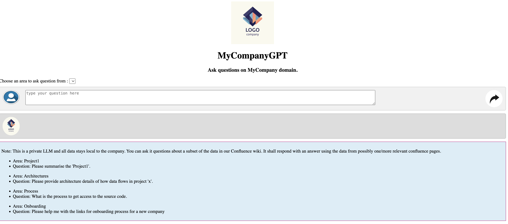

# ConfluenceGPT
To the Organisations/Companies who use Confluence for hosting their product/process knowledge,
 - This open source project provides them the ability to have an internal chatGPT kind of application(it does not use chatGPT or any other commercial APIs, its all free and open source code) up and running in no time,
 - The application is highly configurable and should require no/minimal coding. All you need is to add the configuration as suggested in the section 'Configuration Steps'. You can change/configure almost everything (e.g. LLM model, embedding model, confluence page details etc),
 - The application can answer questions using the information available in the confluence, and also cites the source confluence pages from which the answer has been sourced, 
 - Most importantly, it provides you a project structure with some best practices to get a head start if you plan to use open source(or even paid) LLMs for your specific use cases,
 - The application has been tested in standard company deployment environments and has solved many problems which you would otherwise face when developing such an LLM based application from scratch. These problems and their solutions are mentioned in the article - https://medium.com/p/6ba4505149b2
 - The application downloads all its dependencies one time and later can be run totally in standalone mode i.e. not network call is made during each question/answer.
 - The application uses only free and open source libraries, embedding models and large language models (refer .env file).

## Who Would Benefit from this
Developers and data scientists from different organizations evaluating Generative AI and who would want to get a quick head-start by leveraging an internal 
application with no development effort and limited cost (machines to host a Docker container, DNS, etc.).

## What are the benefits
 - This is probably the only free and open source library/application known at this time which allows you to have such an application available totally based on configuration, and tested by deploying in standard environments.
 - It provides a quick headstart on Generative AI for your organization, since you will not start from scratch. You can take a working project structure and tweak it as you need,
 - No Licensing Cost - Since the application uses only free, open source libraries and does not need real-time 3rd party API calls to serve each request after installation, it can provide a cost-effective way to try out and possibly build more advanced solutions.
 - Minimal Development Effort - The application only needs a few customizations to get it up and running within a company's firewalls and security constraints. No code changes are required to begin.
 - Solves Many Challenges For developers - There are many practical considerations e.g. the below ones. It addresses most of these - 
   - Where to store the large language file (minimum size 4 GB, average size 16 GB) ?
   - Which is the appropriate free and open source LLM to use for this use case (we have tested with multiple LLMs before selecting the current one),
   - How multiple instances of the generative AI service can share a single set of LLM, Vector database, and embedding model data so as to have no data redundancy and minimal network bandwidth consumption,
   - How to run such CPU-heavy tasks on developer laptops. This solution has been tested on developer laptops, which is very important for the developer community to consider adopting it,
   - How to get accurate answers from a huge set of confluence pages and minimize hallucinations. It saves users from hallucinations/fabrications to a great extent by dividing the confluence pages into smaller logical chunks as well as by using advanced RAG (Retrieval Augmented Generation) algorithms.
 - Build In-House Expertise - By having readymade code encompassing the entire flow, the developers from your organization/team will not have to start from scratch and instead can build on top of a working framework.
 - Better utilization of Proprietary Knowledge - Many companies have a considerable amount of knowledge stored in Confluence, which can be more easily accessed with this approach than by traditional search. For example, which internal process should be followed for specific tasks, how do you get help on company-specific infrastructure, etc.? With this solution, that knowledge can be better utilized since users will now get more exact answers directly rather than looking through a list of pages returned in the search results.
 - Help your organization support legacy product areas - With such an application available, new developers can more easily ask questions about legacy areas and get answers without taking time from more experienced developers. Organizations will then have reduced risk in the legacy area.

## Architecture
The application uses RAG(Retrieval Augmented Generation) where the context/knowedge required to answer a question is also provided to the LLM along with the question.
In Docker environment, it uses persistent docker volume to store artefacts(LLM, embedding models, vector DB etc) to be shared among pods. This is to ensure that each pod does 
not have to download these large files(LLMs) OR do the computation(fetching confluence page data and building vector DB) separately. For details, please read the article - https://medium.com/p/6ba4505149b2 
. In non Docker(e.g. local) installations, all the runtime artefacts are stored on a project relative local directory.

## Technologies 
 - The application is written in the Python programming language and supports Python version 3.10 and above.
 - It uses Langchain as the framework to interact with a Large Language Model.
 - It uses Gunicorn as the web server. Gunicorn is a popular open source web server for Python applications.
 - It's packaged in a Docker container and can be run on most operating systems and public clouds using any container-supporting infrastructure (e.g., Kubernetes) or in stand-alone mode.
 - It uses Chroma DB as the vector database for indexing data and retrieving relevant documents.
 - It uses dolphin-llama2-7b.ggmlv3.q3_K_M.bin as the default free and open source Large Language Model. You can always change it.
 - (Without docker, the app has been tested mainly on Mac.)

### Configuration Steps
Application uses your  confluence pages as its knowledge base, by dividing this information between different logical area(e.g. your projects, processes, teams etc). You need to identify these logical area depending on your use case. You should configure each area and identify root confluence pages for each area.
#### Confluence related configurations - 
   - Set the values for keys 'CONFLUENCE_URL' and 'CONFLUENCE_USERNAME' in the configuration file '.env'. 
   - Confluence API keys and authentication details - Generate your confluence API keys at 'https://id.atlassian.com/manage-profile/security/api-tokens' OR Get your confluence API key from your Confluence admin., and execute the command 'python3 ./src/utils/encryptionHelper.py <confluence_API_key>'. This shall generate the encrypted keys and update the properties 
     'CONFLUENCE_APIKEY_ENCKEY' and 'CONFLUENCE_PASSWORD_OR_APIKEY' in the environment file '.env'.
   - Confluence pages IDs per logical area - Modify the method 'area_to_root_page_id' in the file 'src/config/appconfiguration.py', to list out the different 'area' and respective confluence page IDs.
     This configuration ensures that users would be able to select specific area on the UI, and get more accurate answers since the code will look for the answers within those 
     pages relevant to the area, thus reducing hallucinations.
   - Icon Configuration - The folder 'src/static' contains icons to be displayed on the application UI. Change the images as per your company details.
   - UI label configuration - Modify the method 'getPageText' in the file 'src/config/appconfiguration.py', replacing placeholder text(company name, sample questions etc) as per  your company/organisation.

#### Docker Configuration - 
   - Shared directory configuration - Modify the file '.env', comment line number 12 and uncomment the line number 9. This is to ensure that instead of a local directory, the applciation downloads LLM artefacts in the shared docker volume.
   - Create a docker image by executing the command - docker build -t 'confluencegpt' . (Don't ignore the '.' in the end). You should have Docker installed and running before executing the command.
   - Run the image.
   - While above steps shall be sufficient for testing, if you want to deploy in your company's official environments(staging/production), you will need the below step.
   - Modify the file 'Dockerfile', modifying line number 3, as suggested in the comments in that file. This is required in case you want to deploy the application in your company's official environments (default Dockerfile uses official 
      Python docker base image, which you cannot use directly for commercial purposes).
 
## Internal Working  
We understand that for certain use cases, you might prefer state of the art paid models(e.g. Google Vertex AI, Gemini) while for other use cases you might prefer free and open source models (e.g. Llama2, Ollama, GPT4 etc through HuggingFace).
The project provides a code structure/skeleton which is reusable, supports the ability to debug among other non-functional requirements.
During the application start-up, the application doesn't do any network call to avoid start-up delay(resulting in deployment failure, given the 'maximum deployment time restrictions' in official environments). Only during the 1st question/request, the code starts
downloading all its dependencies. The app downloads below on the 1st call -
- Embedding model. It downloads the embedding model mentioned in variable 'EMBEDDINGS_MODEL_NAME' in the file '.env' and stores it in the folder 'embeddings' (under path 'COMMON_PARENT_PATH' as configured in the file '.env')
- It queries your company's confluence pages and creates documents from the data present in these confluence pages,
- Using these documents it creates vector indexes. It creates separate index for separate area. This is done to improve the accuracy of answers(app will only look in the specific index for questions related to that area)
- It stores these indexes in Chroma vector DB ((in a folder named 'db' under path 'COMMON_PARENT_PATH' as configured in the file '.env'))
- It downloads a large language model(LLM) (as configured in the variable 'LLM_MODEL_URL' in the file '.env'. You can change the LLM details to use a different LLM, as per your need),
- Next requests(even after application restarts) does not do above activities again and uses the stored information on local/docker volume.

## Local Installation without Docker
- Install Python 3.10.11
- Install project related dependencies using command 'pip3 install -r requirements.txt --use-pep517'
- Modify the file '.env' as suggested in that file.
- Start the service locally using command - 'gunicorn --config src/config/gunicorn_config.py app:app' (If this fails due to gunicorn not being in classpath, you can try setting path variable
  correctly by setting PATH correctly e.g. export PATH=$PATH:<path_to_your_python_installation>/Python/3.10/bin. If this also does not work, use this command to start server: 'python3 -m flask run')
- Application will download  the basic LLM file, it will also download embeddings. Also,
  it will generate index from confluence pages mentioned in file 'src/config/appconfiguration.py' and store it as a chroma vector database under folder(relative to path in property
  'COMMON_PARENT_PATH'  in the file '.env'.
- Page http://127.0.0.1:5000/, this page allows users to enter a question and return the answer as well as the best matching confluence pages using word embedding.

## Dockerized Installation
- This is lot simpler than the above. Assuming you already have docker installed locally, Create a local docker image using command 'docker build -t confluenceGPT' .'
- Start a container from this image either using docker desktop or through command docker run 5000:5000 confluenceGPT.
- In the container console, you can check the url of the web page, its generally 'http://127.0.0.1:5000/'. Launch this url to view the web page where
  you can ask questions.

## Accessing the application
 - Access the UI using root url http://127.0.0.1:5000/ - This provides a UI where you can ask questions and get answers in streaming manner(like chatGPT). When you ask the first question, thats when the application does the one-time task of downloading all its dependencies, so the first request will take time.
 - HTTP API - http://127.0.0.1:5000/ask?query=<question>&area=<areSelectedInDropdown> is the API that can be called by other parts of your application for API integration.
 - Websocket API - http://127.0.0.1:5000/ask/ws?query=<question>&area=<areSelectedInDropdown>. This API is used by the UI to have streaming effect, should not be used for API integration.

## Training LLM for specific wiki pages
By default, the code is trained on all the confluence pages mentioned in array 'area_to_root_page_id' in file 'src/config/appconfiguration.py'. The entries
in this array are like  - ['Project1', [<confluence_page_id_for_root_page_for_Project1>]]. Here the 1st element (i.e. 'Project1') is the logical area(which values will appear in the drop-down on the web page) and
the 2nd element is a list of root confluence page IDs(you can see page ID in the Conflluence url). For each page id in this list, the application extracts text
from that page as well as it children and grandchildren pages(i.e. till 2 levels).
If you want to add a new area, you can add a new entry like above.
If you want to add a new page ID within an area, append the new page ID in the existing list for that area.

## Accuracy related work
 - The application creates different indices for each area so that there is only a small and focussed/relevant data for a given area so that when a question is asked,
the application will search for the answer in only the relevant docs and reduce the chances of hallucination.
 - The default implementation uses Langchain's strategy of Parent Child retriever (https://python.langchain.com/v0.1/docs/modules/data_connection/retrievers/parent_document_retriever/),
    which improves the context quality for answering the question, in addition to the above step.

   
## External network calls made by the application (you should white-list these calls in your comapny's network/firewalls)
It calls below external APIs -
 - <your_company>.atlassian.net ( the atlassian url of your company if you are modifying)
 - cdn-lfs.huggingface.co
 - huggingface.co

## Licensing
This project can be used and distributed freely as per the MIT licnese. Please refer LICENSE.md for more details.

## Disclaimer
By using Castlight’s Open Source Tool, You understand and agree to the following:

CASTLIGHT PROVIDES THIS OPEN SOURCE TOOL “AS IS”, WITHOUT WARRANTY OF ANY KIND, EXPRESS OR IMPLIED, INCLUDING BUT NOT LIMITED TO THE WARRANTIES OF MERCHANTABILITY, FITNESS FOR A PARTICULAR PURPOSE AND NON-INFRINGEMENT.

IN NO EVENT SHALL CASTLIGHT NOR ANY OF OUR AFFILIATES, BE LIABLE FOR ANY CLAIM, DAMAGES OR OTHER LIABILITY, WHETHER IN AN ACTION OF CONTRACT, TORT OR OTHERWISE, ARISING FROM, OUT OF OR IN CONNECTION WITH THE SOFTWARE OR THE USE OR OTHER DEALINGS IN THE SOFTWARE.

IN NO EVENT SHALL CASTLIGHT OR OUR AFFILIATES BE LIABLE FOR ANY SPECIAL, PUNITIVE, CONSEQUENTIAL, INCIDENTAL OR INDIRECT DAMAGES, HOWEVER CAUSED, ON ANY THEORY OF LIABILITY EVEN IF YOU HAVE BEEN ADVISED OF THE POSSIBILITY OF SUCH DAMAGES.

IN NO EVENT IS CASTLIGHT LIABLE FOR ANY DAMAGES CAUSED BY YOUR OR ANY THIRD PARTY'S ACTS OR OMISSIONS.

The application code has been tested on few environments as mentioned in the ‘Technical Details’ section, but it may have possible  issues when being installed on user’s environments. Castlight is not providing any technical support on fixing any potential issues.

The project does not ship any data or code from the Castlight application. It does not transfer any user data back to Castlight.

The code does not ship any 3rd party code (library or large language model). It downloads all the required libraries and models during installation using user's system/network.

Our Open Source tool may display inaccurate info, including about people, so double-check its responses.
